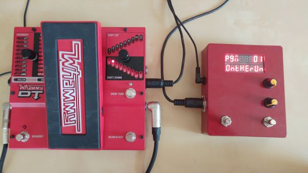
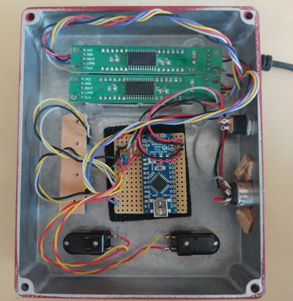

# Whammy Sequencer

This guitar pedal is a sequencer for the Whammy DT.

## Schematic

- 1 x Arduino Nano
- 2 x MAX7219 7 segments modules
- 2 x 220k resistors
- 2 x 10k resistors
- 2 x footswitches
- 2 x rotary encoders
- 1 x DIN midi port
- 1 x DC jack

## Software

To display characters with 7 segments displays, install the LedControl library and patch it with LedControl.h.patch file.

## TODO

 - Check compatibility with all whammy pedal, if not add a setting
 - Add a setting to choose between true bypass and buffered bypass
 - Move presets in PROGMEM
 - Add a tap tempo
 